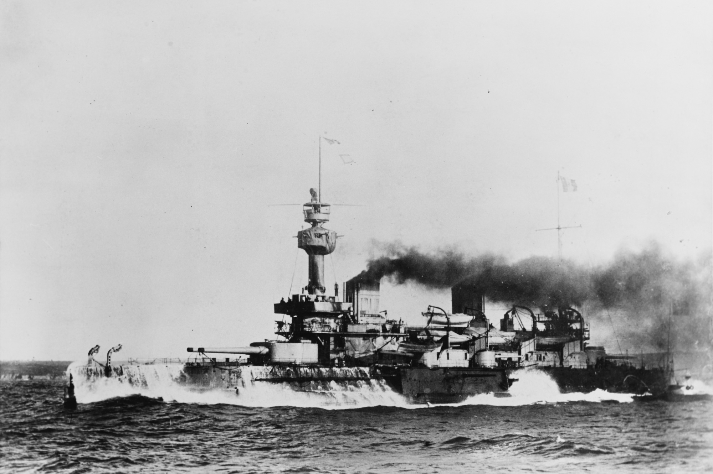
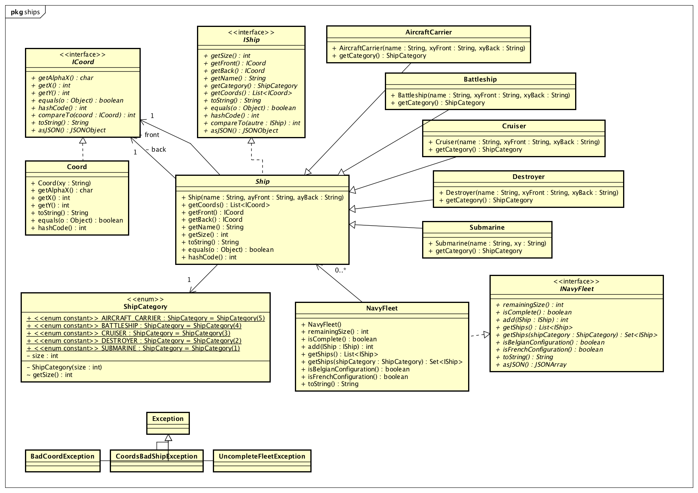
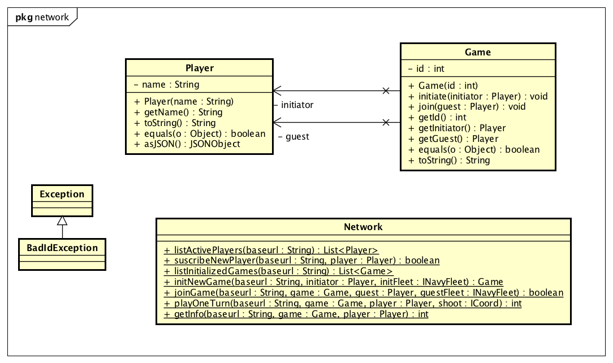

# Projet S2 : Bataille Navale

## Présentation rapide 

Notre projet conciste a développer une application cliente permettant de jouer 
en réseau à la bataille navale : https://fr.wikipedia.org/wiki/Bataille_navale_(jeu)

Un serveur de jeu nous est accessible en ligne sous la forme d'une API Rest
 (http://37.187.38.219/api/v0) et une librairie Java 
 interfaçant le serveur vous est fournie (en partie).

Notre equipe est composée de 4 membres : 

   - ADAM Jérémy
   - BERVOAS Nicolas
   - BROIS Sylvain
   - CAUBERE Maël

## Travail à faire

### initialisation du projet

   Le depot Git porte le nom suivant : projetS2-2021-19-JFB

### implémentation de `ships.*`

   Nous avons fini l'implémentation des differenes classes du paquage 'ships'

### utilisation de `info1.network.Network` ...

Nous avons uttilisé la librairie 'Network' qui nous est fournie afin de : 
   - initialiser un joueur
   - initialiser une partie
   - rejoindre une partie 
   - Jouer un tour en effectuant un tir

Plus de détail sur l'usage de la classe Network dans .

### ... et développement d'une interface graphique

Développez une interface graphique en Swing vous permettant de jouer, cad

1. positionner des bateaux

2. créer une flotte de bateaux

3. initialiser une partie sur le serveur

4. rejoindre une partie initialisée sur le serveur

5. jouer via le serveur

6. gagner ;-)

## Remarques 

Chaque groupe aura un enseignant-référent qui passera
vous voir régulièrement afin de vous assister 
mais aussi évaluer votre travail.

_Image du bateau issue de https://en.wikipedia.org/wiki/French_battleship_Brennus_
